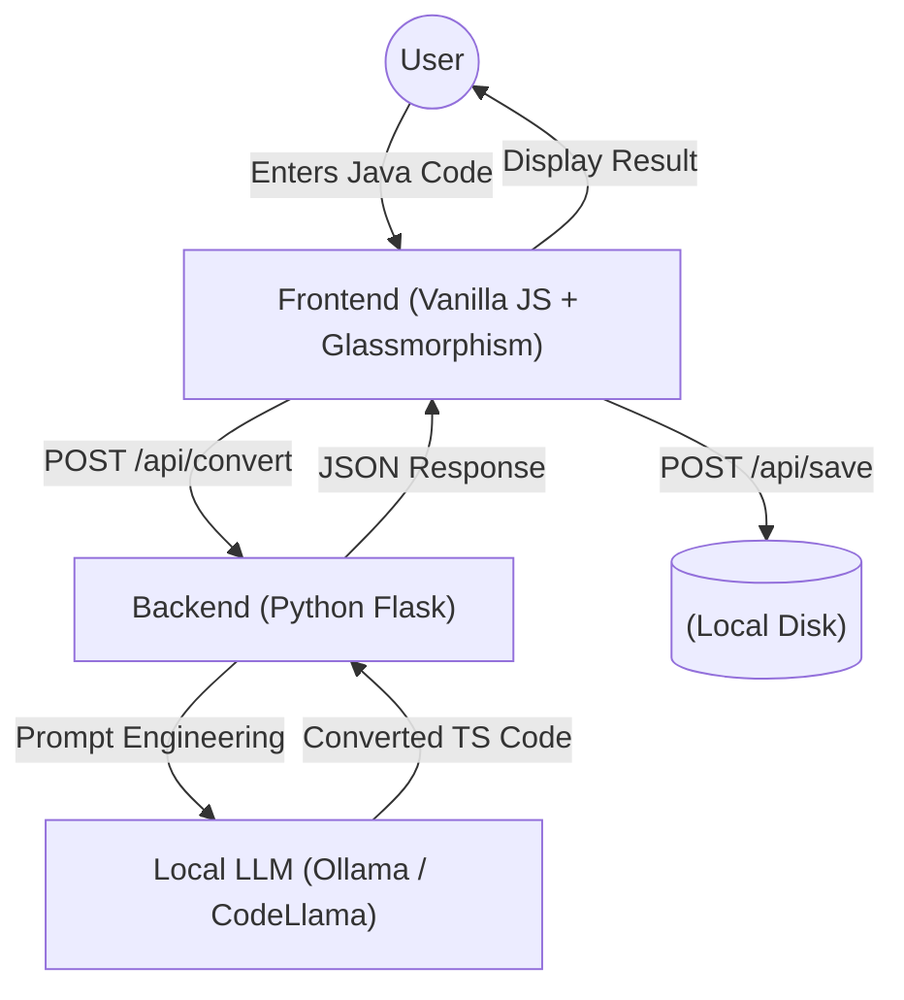

# ⚡ Selenium to Playwright Converter (Local LLM)

A majestic, privacy-focused tool that uses a **Local LLM (Ollama)** to intelligently convert legacy **Selenium Java** code into modern **Playwright TypeScript/JavaScript**.

Built with the **B.L.A.S.T.** protocol, this application runs entirely on your machine—no data leaves your local environment.

## 🏗️ Architecture

The application follows a 3-layer architecture:



## ✨ Features

- **Local & Private**: Uses Ollama (e.g., `codellama`, `llama3`) running locally. No cloud API keys required.
- **Intelligent Conversion**: Doesn't just swap syntax; it rewrites tests using Playwright best practices (e.g., `await page.locator()`, `test.beforeEach`).
- **Modern UI**: A premium, responsive interface with Glassmorphism design and dark mode.
- **Save to Disk**: One-click save for converted files.

## 🚀 Getting Started

### Prerequisites

1.  **Ollama**: generating text.
    *   [Download Ollama](https://ollama.com) and install it.
    *   Pull the model: `ollama pull codellama` (or `llama3`).
2.  **Python 3.8+**: checking backend logic.
    *   Verify with `python --version`.

### Installation

1.  **Clone the Repository**
    ```bash
    git clone https://github.com/kamyagupta16/SeleniumtoPlaywright.git
    cd SeleniumtoPlaywright
    ```

2.  **Install Dependencies**
    ```bash
    pip install flask flask-cors
    ```

3.  **Start Ollama**
    Ensure your local LLM server is running:
    ```bash
    ollama serve
    ```

### Usage

1.  **Start the Application**
    ```bash
    python backend/app.py
    ```
    You should see: `Backend running on http://localhost:3001`

2.  **Open in Browser**
    Navigate to [http://localhost:3001](http://localhost:3001).

3.  **Convert Code**
    *   Paste your **Selenium Java** code into the left panel.
    *   Click **"Convert Code"**.
    *   Wait for the AI to rewrite it into **Playwright TypeScript**.
    *   Click **"Save"** to download the result.

## 📂 Project Structure

```
Project Root
├── backend/
│   └── app.py           # Flask Server & LLM Orchestrator
├── frontend/
│   ├── index.html       # Single Page App
│   ├── style.css        # Premium Glassmorphism Styles
│   └── script.js        # UI Logic & API Handlers
├── output/              # Directory for saved converted files
└── tools/               # Helper utilities
```

## 🛡️ License

MIT License. Free to use and modify.
